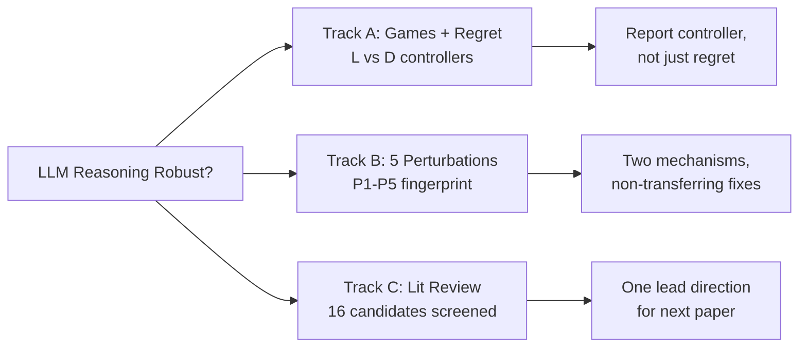
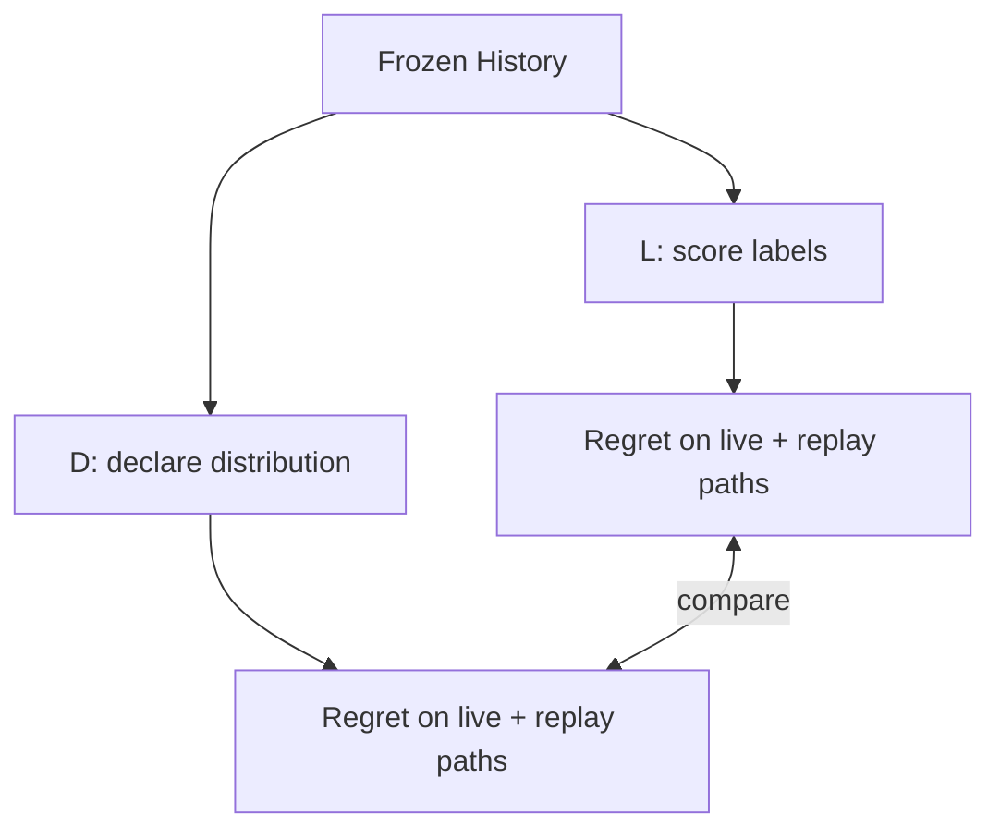
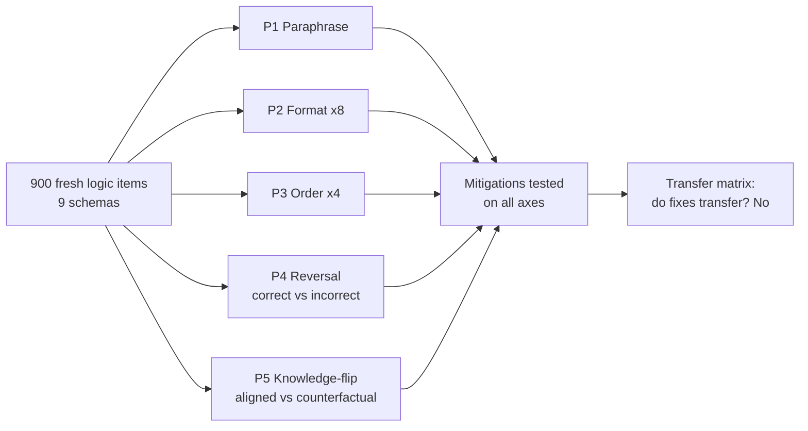
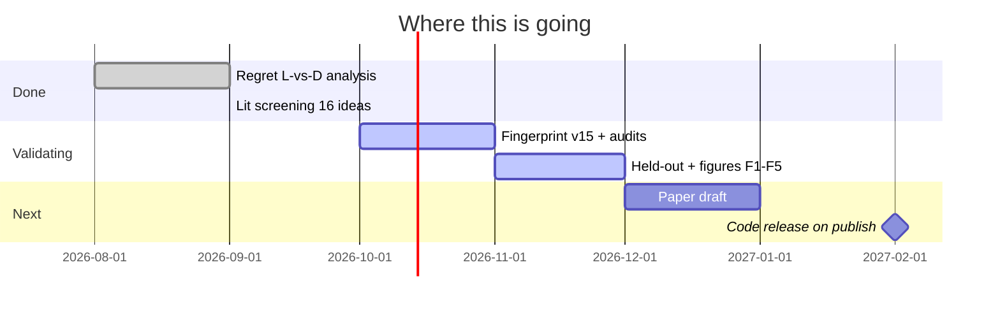

# Research-Work: LLM Reasoning, Consistency & Strategic Evaluation

> **Same logic, different behavior?** I test whether LLM reasoning quality survives elicitation changes, surface perturbations, and counterfactual premises — or breaks in systematic ways.

**This repo currently contains only this README as a public log. Code, datasets, and full results will be released after publication.**

---

## 1. At-a-glance — 30 sec for visitors

| Track | Core Question | Status | Key Signal (glimpse only) |
|---|---|---|---|
| **A. Regret & Elicitation** | Does regret change if you score vs ask the model? | Analysis complete, writing | L ≠ D, no universal winner |
| **B. Perturbation Fingerprints** | Is inconsistency one failure or two mechanisms? | Validating, v15 | Surface vs conflict dissociate, fixes don't transfer |
| **C. Direction Screening** | What is actually novel for 2025-26? | Screening 16 ideas | 1 lead retained, rest scoped |

---

## 2. Track A — Do Regret Numbers Depend on How You Ask?

**Design in one line:** Same models, same histories, same games — two ways to get actions — compare regret.

| What was compared | Glimpse result |
|---|---|
| Fixed-state policy gap TV(L,D) | **0.29 – 0.37** across 3 models, persists in subset |
| Live regret winner | Descriptive lean in 8/9 rows |
| Common-path advantage | **Sign flips in 7/9 rows** — not the same story |
| Statistical bar | Only 2 contrasts exclude zero, none pass practical margin |

> **Takeaway:** L and D are different controllers, not two readings of one policy. Report checkpoint + template + elicitation + scoring + sampling + precision together.

| Tried | Failed | Lesson |
|---|---|---|
| Assume L ≈ D | Failed — large persistent gap | Model the controller |
| Token-length normalization as fix | Did not explain gap | Keep as audit, not fix |
| Claim universal winner | Failed — direction flips by model/path | Report decomposition |

---

## 3. Track B — Perturbation Fingerprints [MAIN THREAD]

**Idea:** Each model has a stable inconsistency signature across 5 axes. Surface noise vs belief-conflict fail differently.

### 3.1 Fingerprint concept — qualitative only

| Model family* | P1 Para | P2 Format | P3 Order | P4 Reversal | P5 Counterfactual |
|---|---|---|---|---|---|
| M1 | Low | Med | Low | High | High |
| M2 | Low | High | Med | High | Med |
| M3 | Med | High | Med | Very High | High |

`* Anonymized. Exact models, scores, CIs withheld. Pattern only: rank order changes across axes — no single most-consistent model.`

### 3.2 Build log — why v7 → v15

| Version | What broke | Fix |
|---|---|---|
| pilot / v7 | P5 gap ≈ 0, counterfactuals too weak | Strengthened conflict + filters |
| v9 / v10 | Timeouts, OOM, lost runs | Resumable + cached JSONL, subset P2/P3 |
| v10 FIXED / v12 | Pairwise hid brittleness | Switched primary to setwise |
| v13 | PD-game collapsed depth signal | Moved to richer games |
| v15 master | Drift null at wrong layer | Layer sweep + accuracy control |

### 3.3 Non-transfer glimpse

| Mitigation | Helps home axis? | Transfers? |
|---|---|---|
| Flag & reason | P5 yes | P2 / P4 ≈ zero or negative |
| Format-anchoring | P2-seen yes | P2-unseen / P5 no |
| Self-consistency 10x | P1 / P3 yes | P4 / P5 marginal |
| Quit / abstain | Selective-acc up | Coverage down — tradeoff |

> **Takeaway:** Fixes overfit to their home axis. Off-diagonal failure is the finding.

---

## 4. What failed → what changed [master]

| # | Attempt | Outcome | Current rule |
|---|---|---|---|
| 1 | One metric (accuracy) | Hid inconsistency | Always accuracy + consistency + coverage + cost |
| 2 | Public benchmarks only | Leakage risk | Fresh items + private held-out |
| 3 | Single perturbation | Looked incremental | 5 axes, same items/models/metrics |
| 4 | One-shot mitigation claim | Did not transfer | Full mitigation x axis matrix |
| 5 | Greedy-only, no audit | Reviewer-rejectable | Multi-seed + human audit required |

---

## 5. Track C — Literature screening

16 ideas screened on Feasibility → Falsifiability → Novelty → Confounds. No ranking, only gates.

| Family | Example directions | Verdict |
|---|---|---|
| Reasoning failures | Mirrored rationalization, self-consistent math errors, PRM collapse, over/underthinking joint control | **1 lead retained:** self-consistent errors in math + black-box vs white-box detection |
| Multi-agent knowledge | Concurrent-write graphs, provenance retrieval, skew triage, conditional comms, rollback + audit | Scoped as recombination unless collapse-condition holds |
| Discarded for now | Tool-use fix, multilingual faithfulness, RLVR-overthinking | Insufficient 2024-26 anchor |

> Lead next step needs pilot partition test first: if consistent-wrong rate <2% or detectors tie, premise fails — still reported as boundary result.

---

## 6. Roadmap

---

## 7. Reproducibility & release policy

| Available now | Withheld until publication |
|---|---|
| Research questions, design sketches, qualitative patterns | Prompts, generator code, seeds, splits |
| Failure log + lessons | Checkpoints, decoding configs, metric scripts |
| Direction verdicts | Full tables, CIs, figures, audit guides |

If you are a professor / collaborator skimming this: Tracks A+B share one principle — **protocol defines the measurement**. I am happy to discuss direction and results under collaboration, not via repo artifacts yet.

**Contact:** via GitHub [@nagajaideep](https://github.com/nagajaideep) — please open an issue with `[collab]` prefix.

*Last updated: Oct 2026. Active.*
