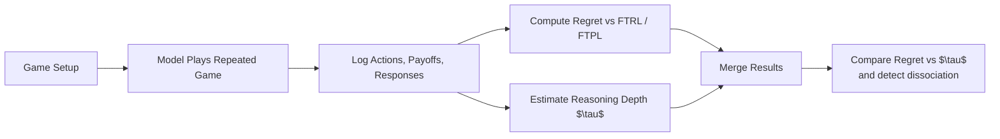

# Deep but Not No-Regret: Dissociating Reasoning Depth from Online-Learning Optimality in LLM Agents

A research project exploring whether deeper reasoning in large language models translates into better no-regret behavior in repeated strategic games.

This repository captures the experimental pipeline, the literature framing, early results, and the evolution of the project from a broad idea into a concrete benchmark study.

---

## 1. The core idea

The central question is simple but important:

> Does a model's reasoning depth ($\tau$), inferred from behavioral game theory, predict its performance under formal no-regret metrics such as FTRL and FTPL?

Or can the two diverge?

In other words, a model may appear to reason more deeply, yet still behave poorly in repeated strategic environments when judged by online-learning standards. This is the core research gap the project is investigating.

The project sits within the wider umbrella of:

- No-regret learning
- Multi-agent strategic interaction
- Behavioral game theory
- LLM reasoning and decision-making

---

## 2. Why this project matters

The usual narrative in LLM reasoning work is that more reasoning should produce better decisions. But this may not hold in strategic, adversarial, or repeated settings.

This project tests a sharper claim:

- When an LLM is evaluated on repeated games, does higher reasoning depth actually correspond to lower regret?
- Or do reasoning traces and online-learning performance come apart?

This matters because it moves beyond generic "reasoning helps" claims and asks whether reasoning quality actually maps to strategic learning quality.

---

## 3. Research framing

This project is best understood as an empirical benchmark that combines two lines of work:

1. Formal no-regret learning in repeated games and online learning
   - Metrics based on FTRL and FTPL
   - Standard benchmark from Park et al.

2. Behavioral reasoning depth in strategic games
   - $\tau$ estimation using TQRE / cognitive hierarchy style fitting
   - Standard benchmark from behavioral game theory literature

The main novelty is not a brand-new theory, but an actual joint measurement of both signals on the same models and the same games.

---

## 4. Research question in one sentence

Are the model's strategic reasoning depth and no-regret performance aligned, or can they diverge in repeated games?

---

## 5. The experimental setup

### Models explored

The project initially tested feasible open-weight models on Kaggle T4 GPUs, replacing larger models with smaller, tractable counterparts.

Examples from the run logs include:

- Llama-3-8B-Instruct
- DeepSeek-R1-Distill-Qwen-14B
- Qwen3-8B
- GLM-4-9B-Chat

The model set evolved over time as the experiment matured and as engineering constraints were handled.

### Games explored

The core games include repeated strategic benchmark games from the Park et al. framework, including:

- Prisoner's Dilemma
- Cyclic game
- Second-best game
- other canonical benchmark games considered in the full study plan

The key design principle is that some games are structurally poor for estimating reasoning depth because they collapse all higher reasoning levels to the same best response. This is why the project shifted away from Prisoner's Dilemma for $\tau$ estimation and toward games with richer strategic structure.

### Metrics used

#### Regret

The project measures actual cumulative regret versus FTRL and FTPL baselines.

This is the formal online-learning lens:

- low regret means the model behaves close to a no-regret learner
- regret is measured against practical baselines rather than just payoff totals

#### Reasoning depth $\tau$

The project estimates reasoning depth using a strategic-choice fitting method inspired by TQRE / cognitive hierarchy models.

The idea is to infer a latent reasoning depth from the distribution of actions over repeated one-shot strategic decisions.

---

## 6. The project pipeline

The pipeline evolved over time from a single-model proof-of-concept to a multi-model, multi-game benchmark.

---

## 7. Early findings

### 4-model cyclic result

This is the clearest result stored in the repo:

| Model | Regret vs FTRL | $\tau$ |
|---|---:|---:|
| Llama-3-8B-Instruct | +5 | 4.36 |
| DeepSeek-R1-Distill-Qwen-14B | -4 | 4.36 |
| Qwen3-8B | +2 | 2.26 |
| GLM-4-9B-Chat | +3 | 1.59 |

These values show that:

- the reasoning-depth metric can distinguish some models
- but a few models collapse to the same $\tau$ because the game structure produces degenerate action distributions
- the most interesting comparison is not always the headline one; the trustworthy signal can be the less dramatic one

### Key interpretive insight

The project found an important methodological result:

- Some games are structurally bad for $\tau$ estimation because every higher reasoning level predicts the same action.
- Prisoner's Dilemma is one such case.
- This is not a coding bug; it is a game-design limitation.

This is exactly why the study later shifted toward richer games such as Cyclic and Second-Best.

---

## 8. Current working direction

The working title remains:

> Deep but Not No-Regret: Dissociating Reasoning Depth from Online-Learning Optimality in LLM Agents

This is treated as a working title rather than a final claim. It signals the possibility of a real dissociation result without overcommitting before the data is strong enough.

---

## 9. Final summary

This project studies a precise question in strategic AI:

Do reasoning-capable LLM agents become better no-regret learners in repeated strategic settings, or do they simply reason more without improving their online-learning behavior?

The work combines repeated-game evaluation, regret analysis, and reasoning-depth estimation in a single benchmark framework, with the goal of understanding whether these axes align or diverge in practice.
